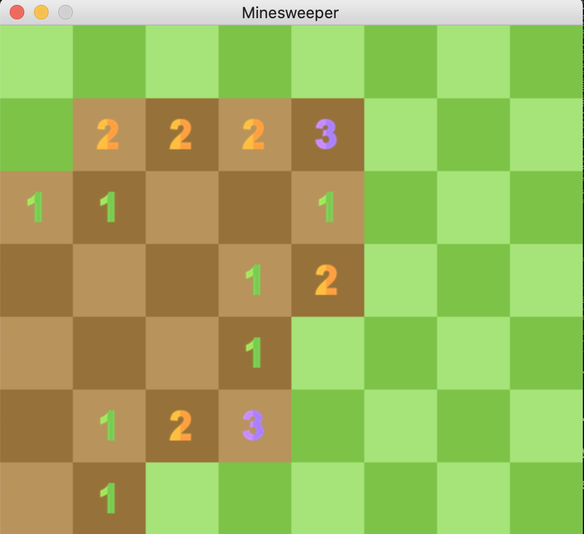

# Minesweeper

This is my Pygame interpretation of the classic Windows game Minesweeper.

### Game Rules
1. The first click is a freebie, you won't ever click on a mine.

  

2. The numbers displayed on each tile show the number of mines adjacent to it in a 3x3 grid. 

  

3. Right-click to place a flag over suspected mine locations. In order to win, you must clear all tiles except for the ones containing mines.   

  

